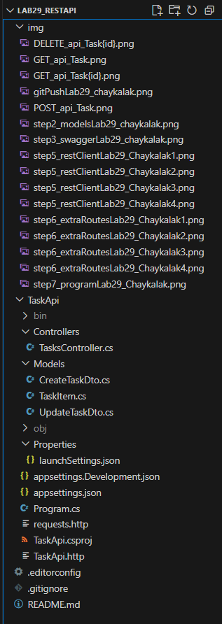

# Лабораторная работа №29: REST API на ASP.NET Core

## Основная информация

**ФИО:** Чайкалак Данара Рустамовна

**Группа:** ИСП-231

**Дата:** 06.06.2026

## Краткое описание работы

В ходе выполнения лабораторной работы были изучены:

- Принципы архитектуры REST и что делает API RESTful
- Создание контроллера с полным набором CRUD-маршрутов
- Разница между Minimal API и Controller-based API
- Тестирование API через Swagger UI и расширение REST Client в VS Code
- Правильные HTTP-статусы и формат ответов
- Настройка CORS для взаимодействия с фронтендом

## Структура проекта



## Список всех реализованных маршрутов

| Метод | Маршрут | Описание | Статус |
|-------|---------|----------|--------|
| GET | /api/Task | Получить все задачи (с фильтрацией по completed) | 200 |
| GET | /api/Task/{id} | Получить задачу по id | 200 / 404 |
| POST | /api/Task | Создать новую задачу | 201 / 400 |
| PUT | /api/Task/{id} | Обновить задачу полностью | 200 / 404 |
| PATCH | /api/Task/{id}/complete | Переключить статус задачи | 200 / 404 |
| DELETE | /api/Task/{id} | Удалить задачу | 204 / 404 |
| GET | /api/Task/search | Поиск задач по ключевому слову | 200 |
| GET | /api/Task/priority/{level} | Фильтрация по приоритету | 200 |
| GET | /api/Task/stats | Получить статистику задач | 200 |
| GET | /api/Task/sorted | Сортировка задач по полю | 200 |

## Итоговая таблица ASP.NET Core Controller-based API

| Аспект | ASP.NET Core Controllers |
|--------|--------------------------|
| Маршруты | [HttpGet] атрибут над методом |
| Группировка маршрутов | Класс-контроллер |
| Базовый URL | [Route("api/[controller]")] |
| Параметр пути | (int id) — параметр метода |
| Параметр запроса | [FromQuery] bool? completed |
| Тело запроса | [FromBody] CreateTaskDto dto |
| Ответ 200 | return Ok(data) |
| Ответ 201 | return CreatedAtAction(...) |
| Ответ 404 | return NotFound(...) |
| Ответ 204 | return NoContent() |
| Типизация данных | Строгая (C#) |
| Документация | Swagger — устанавливается отдельно |

## Главные выводы

1. **REST** — не протокол, а архитектурный стиль. Те же принципы работают с любым языком и фреймворком.

2. **Контроллер в ASP.NET Core** = Router в Express, только с автоматической документацией и строгой типизацией.

3. **DTO защищает API** от некорректных данных: клиент передаёт только то, что сервер разрешает принять.

4. **Swagger UI** позволяет тестировать API без Postman и без написания тестового JavaScript-кода.

5. **Правильные HTTP-статусы** — часть «контракта» API. Клиент должен понимать, что произошло, по коду ответа.

## Инструкция по запуску

```bash
cd TaskApi
dotnet run